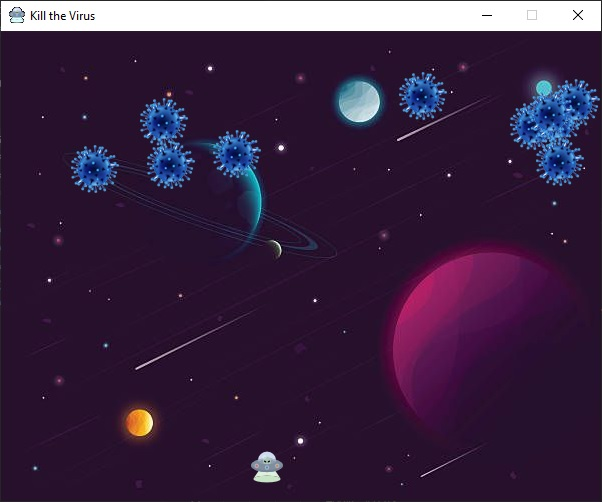

# Kill the Virus

**Kill the Virus** is an Open Source game built with Python. It is inspired by the need to sensitize children to join the fight against the
*Corona Virus*. This game is built just like the popular Space Invaders where the user moves a shooter and tries to shoot all the viruses
before they reach the earth. 

The initial code for this game is based on the tutorial conducted by [Attreya Bhatt](https://github.com/attreyabhatt/Space-Invaders-Pygame). I officially want to thank him for making that tutorial available and helping me understand the basics of PyGame. Though the initial tutiorial code was in procedural form. I have restructured the code to fully Object Oriented format (OOP), and extended by adding more features like sounds and levels and multi-screens.

# Requirements
This game is built on Pygame 1.9.6 running on Python 3.7. I believe that any version of Python 3+ will be able to run this game perfectly well. No other dependencies are required to run this game.

# How to Play
Use the <code>arrow</code> keys to move LEFT and RIGHT. Movements are only allowed on the X axis.  Use <kbd> SPACEBAR </kbd> to shoot the viruses.
If the virus reaches the earth or touches you, you are killed! Each virus you kill earns you one point

# How to Contirbute
I am still coming up with guidelines for contributing but you can fork, clone the repo. Make your changes and send me a Pull Request We go from there. If you encounetr any error while running this game. Raise an *issue* on the repo.

# Screenshot

   
  
  

 